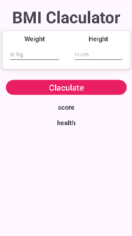
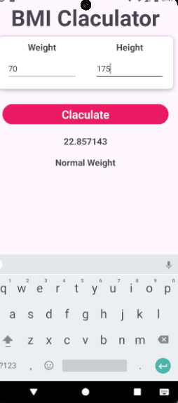

# 🧮 BMI Calculator App (Android - Kotlin)

A simple and elegant **Body Mass Index (BMI) Calculator** built using **Kotlin** and **Android Studio**. This app allows users to input their weight and height to calculate their BMI and understand their health category.

---

## 🚀 Features

- Input weight (kg) and height (cm)
- Calculate Body Mass Index (BMI)
- Display BMI value with health status:
  - Underweight
  - Normal weight
  - Overweight
- User-friendly UI with clean design
- Error handling for empty/invalid inputs

---

## 📱 Screenshots

    

---

## 🛠️ Built With

- **Kotlin** – Modern Android development language
- **Android Studio** – Official IDE for Android
- **ViewBinding** – Type-safe UI interaction
- **Material Design Components** – For a clean UI/UX

---

## 📦 How to Use

1. **Clone this repository**
   ```bash
   git clone https://github.com/your-username/BMI-Calculator-Kotlin.git
